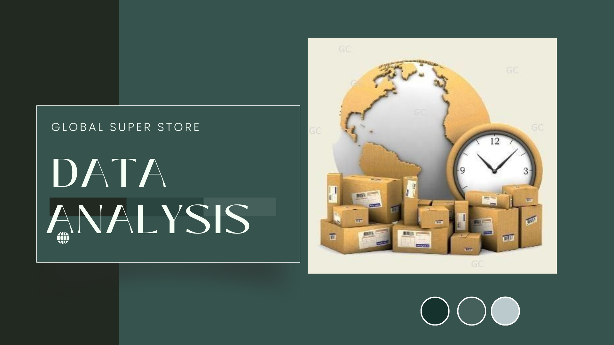
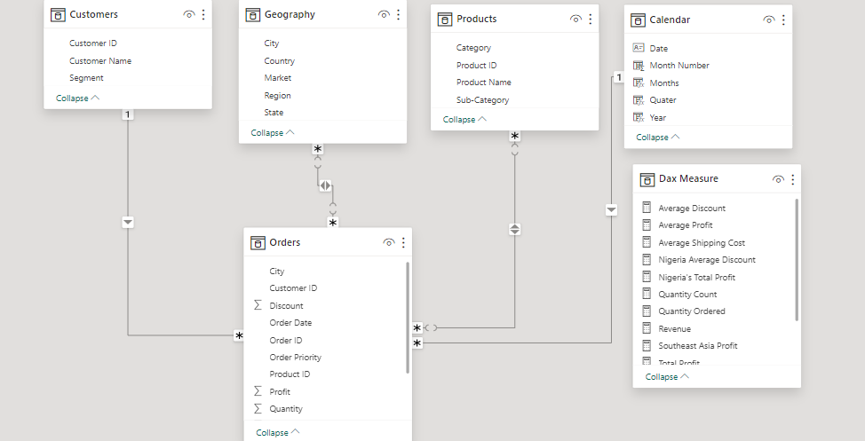
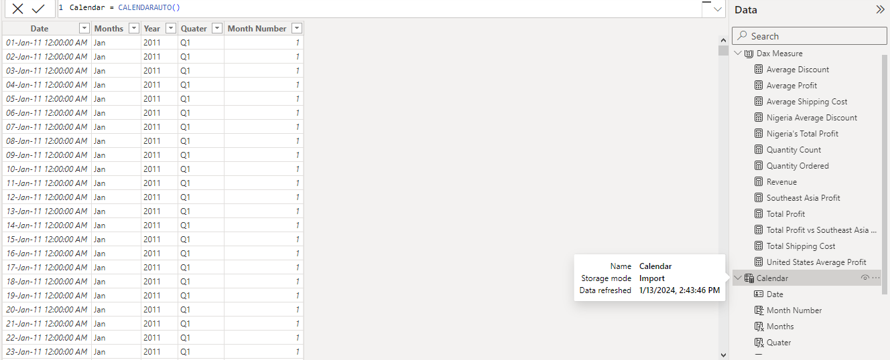
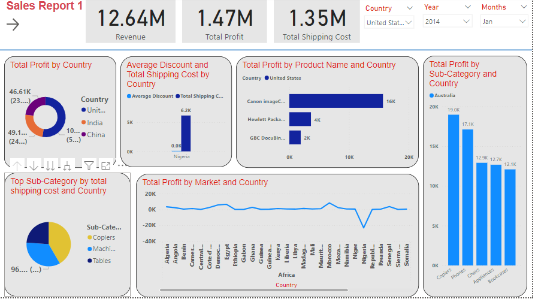
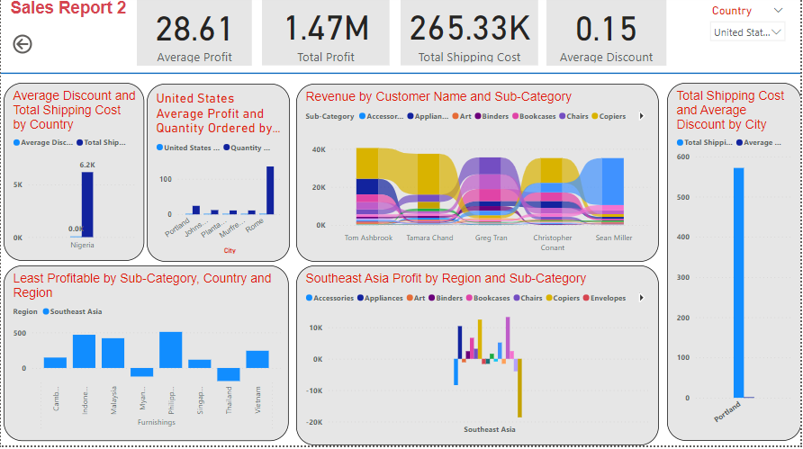

# Global_Super_Store_Analysis-Project

## Introduction
Global Super Store is an online retail store originated in New York with customers across different markets. Global Superstore client base hails from 147 countries across the world offering over 10,000 products, these products are categorized into three main sections which includes: Technology (E.g Machines ,Phones e.tc),Office supplies(E.g Appliances, Binders), and Furniture(E.g Bookcase, Chairs e.tc).

## Data Sourcing
Link to the data Set[here](GlobalSuperstore - Capstone.xlsx - Google Sheets)

## Problem Statement
The aim of this project is to analyze the dataset and provide answers to the following questions;
Question1
1.  What are the three countries that generated the highest total profit for Global Super Store in the year 2014.
2.  For each of these countries find the three products with the highest total profit, specifically what are the product name and total profit for each product?
3.  Identify the three-sub category with the highest average shipping cost in United States.
4.  Access Nigeria’s Profitability (I.e 2014) how does it compares to other countries in Africa?
5.  What factors might be responsible for Nigeria’s poor performance? You might want to investigate shipping cost and discount cost as potential root causes!
6.  Identify the product sub-category that is the least profitable in Southeast Asia Region?
7.  Is there a Specific country in Southeast Asia where Global Super Store should stop offering the sub-category as identified in 4a?
8. Which city is the least profitable in terms of average profit in United states? For this analysis discard the cities with less than 10 orders.
9.  Why is this city’s average profit so low? 
10.  Which product sub-category has the highest average profit in Australia? 
11.  Who are the most valuable customers and what do they purchase?

## Skills Demonstrated
The following Power BI features were incorporated:
- Dax,
- Power Query,
-  Quick Measure,
- Modelling,
- Filters,
- Slicers,
- Buttons

## Data Transformation
I began by retrieving the dataset from the provided link and thoroughly examined the data to determine the most suitable approach, ensuring a comprehensive understanding of the dataset. Data cleansing and analysis are fundamental for any data analyst, and utilizing Power BI Query Editor, I refined the dataset, enhancing visualizations with new data points through the creation of computed columns and measures.I also structured the newly created measures by placing them into a distinct table. This organization helps enhance the clarity and manageability of the dataset, especially when dealing with intricate data models or aiming to keep the primary tables focused on raw data.  This process, known as data modeling, involves organizing columns based on relationships. Subsequently, I implemented necessary DAX measures to derive insights for the specified questions, concluding by presenting my findings through visualizations on a dashboard.
 
## Modelling
Because i have supported this data with new tables there was a need to connect them based on relationship.
Model                    |  Calendar-Table
:-----------------------:|:----------------:
       |    

## Visualization
To illustrate my visuals, I made use of a range of charts and graph which entails: Cards, Slicers, Pie chart, Line chart, stacked bar chart, Clustered column charts, Line and a clustered column chart and a Ribbon chart in a dash board.
Below is an image of the first dashboard, the key insights from Sales report 1 Dashboard shows the following:

•	In 2014, the Global Superstore experienced its most substantial profits from the United States, China, and India. Notably, the United States contributed 52.36% of the total profit, followed by India with 24.45%, and China with 23.19%.
•	For each of the three countries with the top profit total (United states, China and India) the 3 products with the highest profit are described below:
1. United States	Canon Image CLASS 2200 ADVANCED COPIER	15,679.96, Hewlett Packard Lazer Jet 3310	3,623.94, GBC DocuBIND TL 300 Electric Binding System	1,910.59.
2. India	Sauder classic Book Case Traditional 	2,419.65, Cisco Smart Phone with Caller ID	1,609.38, Hamilton Beach Refrigerator RED	1,440.20
3. China	Sauder Classic Bookcase METAL	1,463.07, Bush Classic Book Case Mobil	1,220.52, HP Copy Machine Color	1,196.13
 As seen on the dashboard to regulate or view the visualization it can be controlled by the slicer.
 N/B- not all visuals on this image dashboard are controlled by the Slicers I have edited interactions.

•	The sub-categories with the highest average shipping costs are Copiers, Machines, and Tables.

•	Among the products in Australia, Copiers stand out with the highest average profit.

•	Nigeria experienced a significant decline in profit during 2014, losing over $23,285.19 compared to other African countries.

DASH BOARD SALES REPORT 2

•	Upon investigating Nigeria's discount and shipping costs, it is evident that the primary factor contributing to Nigeria's poor performance is the exorbitant shipping costs.

•	 In the Southeast Asia region, Furnishings emerges as the least profitable product sub-category. Notably, Thailand stands out as the country with the highest loss in Furnishing sales.

•	The city with the least profit, measured by average profit, in the United States is Portland, with a total average profit of 0.42 and 24 orders.

•	 The low average profit in Portland can be attributed to the high shipping costs. A comparison of discount costs and shipping fees revealed that approximately $571.91 was spent on shipping, significantly outweighing the discount costs of about $0.30.

•	- The top five most valuable customers include Tom Ashbrook, making the highest purchases from Copiers, followed by Tamara Chand with the highest Copiers purchases as well. Greg Tran leads in purchases from Chairs, Christopher Constant in Copiers, and Sean Miller in Accessories.
## Recommendation

Given the comprehensive analysis conducted on the dataset, here are some recommendations:

Optimize Shipping Costs:
Investigate ways to optimize shipping costs, particularly in regions with notable profit declines, such as Nigeria. Addressing high shipping costs may contribute to improved profitability.

Product Sub-Category Adjustments:
In Southeast Asia, evaluate the profitability of the identified least profitable product sub-category. Consider discontinuing this sub-category, especially in specific countries where it is underperforming.

City-Specific Strategies:
For the least profitable city in the United States, explore city-specific strategies to improve profitability. This could involve revisiting shipping cost structures or implementing targeted marketing campaigns.

Customer Segmentation:
Further segment and analyze customer behavior, especially focusing on the most valuable customers. Tailor marketing or engagement strategies to retain and potentially expand relationships with these high-value clients.

In summary, the data analysis points to significant insights. The United States led in profits, while Copiers, Machines, and Tables had the highest average shipping costs. In Australia, Copiers showed the highest average profit. Nigeria faced a notable profit decline due to high shipping costs. Southeast Asia's least profitable sub-category was Furnishings, with Thailand experiencing the highest loss. In the United States, Portland had the lowest average profit, primarily attributed to exorbitant shipping costs. The top five valuable customers made substantial purchases in specific product categories, offering strategic insights for the Global Superstore's operations.

